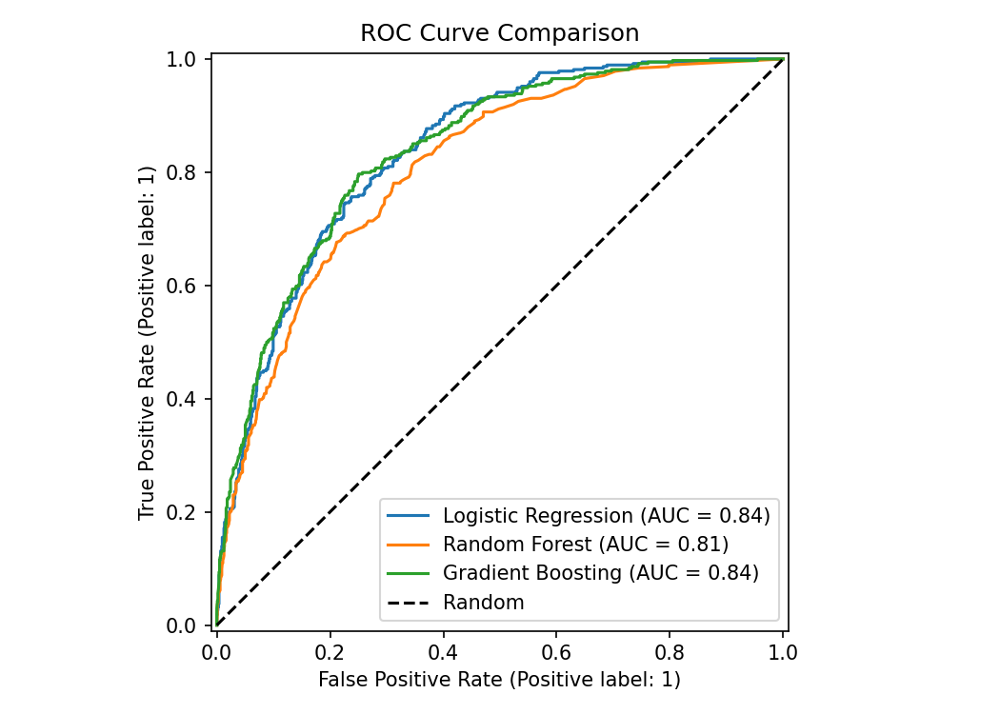
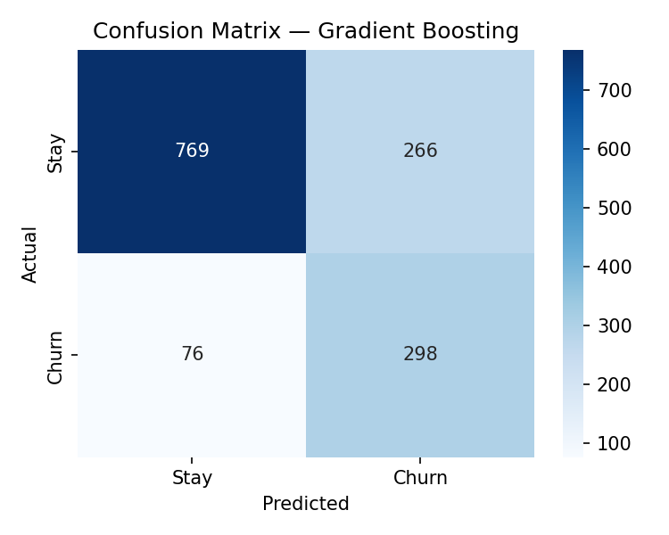
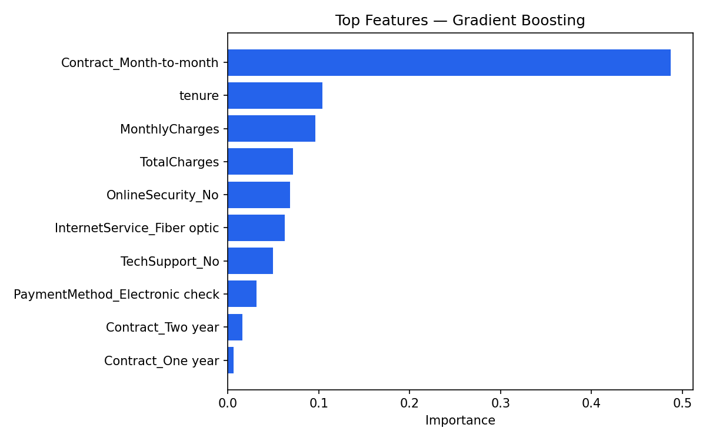

# Customer Churn Prediction

[](https://www.python.org/downloads/)
[](https://scikit-learn.org/)
[](LICENSE)

End-to-end machine learning project that predicts telecom customer churn, compares multiple classifiers, and extracts actionable business insights.

---

## Business Problem

Customer churn directly impacts recurring revenue. In retention campaigns, **false negatives** (predicting a customer will stay when they will leave) are especially costly because the company misses the chance to intervene.

This project optimizes for **Recall** and **ROC-AUC** — not accuracy alone — to catch as many at-risk customers as possible.

---

## Dataset

**IBM Telco Customer Churn Dataset** — 7,043 customer records with demographic, account, and service features.

| Field | Description |
|-------|-------------|
| Target | `Churn` — Yes / No |
| Numerical | `tenure`, `MonthlyCharges`, `TotalCharges` |
| Categorical | `Contract`, `PaymentMethod`, `InternetService`, `OnlineSecurity`, `TechSupport` |

**Source:** [IBM Telco Customer Churn on GitHub](https://github.com/IBM/telco-customer-churn-on-icp4d)

---

## Project Structure

```
customer-churn-prediction/
├── data/
│   └── raw/                    # Dataset (not committed — see Setup)
├── notebooks/
│   └── 01_eda.ipynb            # Exploratory data analysis
├── outputs/
│   ├── figures/                # Confusion matrices, ROC curves, feature importance
│   ├── models/                 # Saved best model + preprocessor
│   └── results/                # CSV metric summaries
├── scripts/
│   └── download_data.py        # Download dataset automatically
├── src/
│   ├── config.py               # Paths and hyperparameters
│   ├── load_data.py
│   ├── preprocessing.py
│   ├── train.py
│   ├── evaluate.py
│   ├── explain.py
│   └── save_model.py
├── app.py                      # Streamlit prediction demo
├── main.py                     # Training pipeline entry point
├── requirements.txt
├── LICENSE
└── README.md
```

---

## Setup

### 1. Clone the repository

```bash
git clone https://github.com/<your-username>/customer-churn-prediction.git
cd customer-churn-prediction
```

### 2. Create a virtual environment

```bash
python -m venv .venv

# Windows
.venv\Scripts\activate

# macOS / Linux
source .venv/bin/activate
```

### 3. Install dependencies

```bash
pip install -r requirements.txt
```

### 4. Download the dataset

```bash
python scripts/download_data.py
```

Or manually download [Telco-Customer-Churn.csv](https://raw.githubusercontent.com/IBM/telco-customer-churn-on-icp4d/master/data/Telco-Customer-Churn.csv) and place it at `data/raw/telco_customer_churn.csv`.

---

## Usage

### Train and evaluate all models

```bash
python main.py
```

Skip cross-validation for a faster run:

```bash
python main.py --skip-cv
```

This will:
1. Load and preprocess the data
2. Run 5-fold stratified cross-validation
3. Train Logistic Regression, Random Forest, and Gradient Boosting
4. Evaluate on the held-out test set
5. Save figures to `outputs/figures/`
6. Save the best model to `outputs/models/`

### Launch the Streamlit demo

```bash
streamlit run app.py
```

### Explore the data

```bash
jupyter notebook notebooks/01_eda.ipynb
```

---

## Methodology

### Preprocessing
- Target encoding: Yes/No → 1/0
- Missing `TotalCharges` converted and imputed with median
- One-hot encoding for categorical features
- Standard scaling for numerical features
- Stratified 80/20 train-test split
- Class imbalance handled via balanced class weights (+ sample weights for Gradient Boosting)

### Models
| Model | Key Settings |
|-------|-------------|
| Logistic Regression | `class_weight=balanced`, max_iter=1000 |
| Random Forest | 200 trees, `class_weight=balanced` |
| Gradient Boosting | Balanced sample weights |

### Evaluation Metrics
Accuracy, Precision, Recall, F1, ROC-AUC, Confusion Matrix

---

## Results

### Test Set Performance

| Model | Accuracy | Precision | Recall | F1 | ROC-AUC |
|-------|----------|-----------|--------|-----|---------|
| **Gradient Boosting** | **0.757** | 0.528 | **0.797** | **0.635** | **0.839** |
| Logistic Regression | 0.733 | 0.498 | 0.797 | 0.613 | 0.838 |
| Random Forest | 0.777 | 0.596 | 0.500 | 0.544 | 0.810 |

**Best model: Gradient Boosting** — selected by highest ROC-AUC and Recall on the test set.

### Cross-Validation (5-Fold)

| Model | CV Accuracy | CV Recall | CV ROC-AUC |
|-------|-------------|-----------|------------|
| Gradient Boosting | 0.750 | 0.788 | **0.844** |
| Logistic Regression | 0.741 | 0.800 | 0.842 |
| Random Forest | 0.776 | 0.487 | 0.805 |

### Visual Results

**ROC Curve Comparison**



**Confusion Matrix — Gradient Boosting (Best Model)**



**Feature Importance — Gradient Boosting**



---

## Key Insights

| Finding | Business Impact |
|---------|----------------|
| Month-to-month contracts | Highest churn driver — offer upgrade incentives |
| Short tenure | New customers need onboarding support |
| High monthly charges | Price-sensitive segment — targeted discounts |
| No online security / tech support | Upsell add-on services to reduce churn |
| Electronic check payments | Encourage automatic payment methods |

---

## Suggested Retention Strategy

1. **Contract upgrades** — Discounts for switching from month-to-month to annual plans
2. **Early intervention** — Flag customers with tenure < 12 months and high monthly charges
3. **Service bundling** — Promote online security and tech support to at-risk segments
4. **Payment automation** — Incentivize bank transfer / credit card auto-pay

---

## Future Improvements

- [ ] Hyperparameter tuning with `GridSearchCV` / `Optuna`
- [ ] SHAP values for model-agnostic explainability
- [ ] Threshold optimization for business-specific cost functions
- [ ] CI pipeline with GitHub Actions
- [ ] REST API deployment with FastAPI

---

## Tech Stack

Python · pandas · scikit-learn · imbalanced-learn · matplotlib · seaborn · Streamlit · Jupyter

---


---

## Author

Built as a portfolio machine learning project demonstrating end-to-end churn prediction with model comparison, evaluation, and business-oriented insights.
